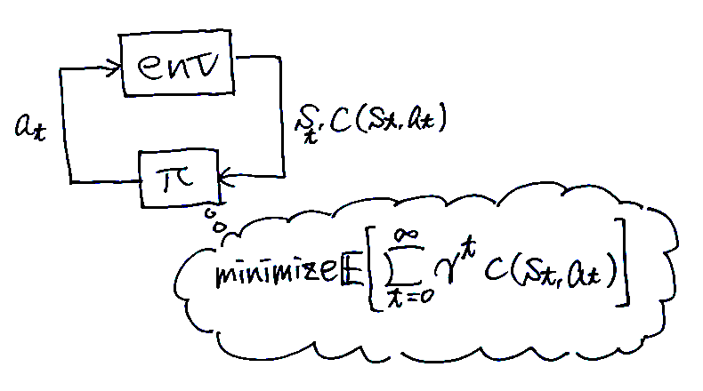
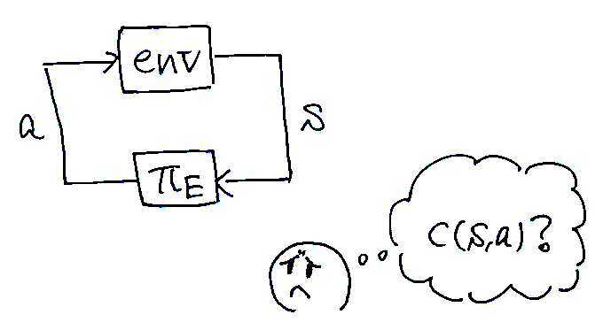
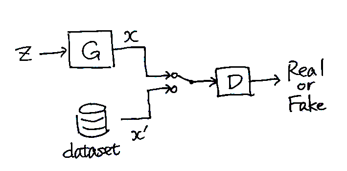
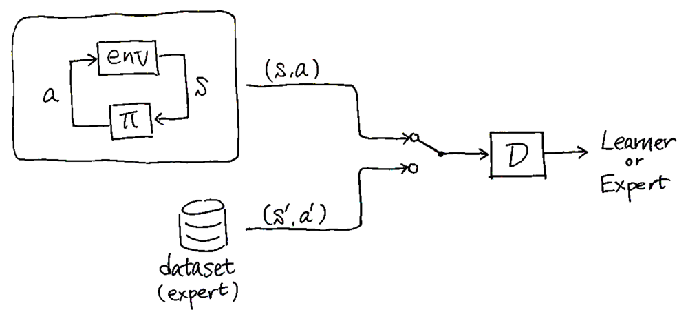

Jonathan Ho and Stefano Ermon, "Generative Adversarial Imitation Learning," in Advances in Neural Information Processing Systems, 2016, pp. 4565-4573. [Online Available](https://papers.nips.cc/paper/2016/hash/cc7e2b878868cbae992d1fb743995d8f-Abstract.html)

# 要約

強化学習と逆強化学習とを統一する定式化をおこなったら，敵対的生成ネットワークと似た形の模倣学習手法が導出できた。

# 基礎知識

まずは研究の背景となる基礎知識から。

## Imitation learning （模倣学習）

熟練者の動作データが与えられた状態で，それを**模倣するように動作を学習**する手法の総称。以下では基本的に，熟練者（$\pi_E$）が環境から状態$s$を受け取って行動$a$を出力する状況を考える。

## Behavior cloning （行動クローニング）

熟練者の行動データを教師データとして**教師あり学習**する手法。熟練者がある状態$s$である行動$a$をしたというデータの組$(s, a)$がたくさんあるとして，$\pi: s \mapsto a$を訓練する。

この方法は教師あり学習なので学習させやすいし，環境とのインタラクションがないので非常にお手軽。しかし学習後は環境とインタラクションすることから**学習前後でタスクが変わる**ことになり（分布シフト），そのせいで性能劣化が避けられないのが本質的な課題である。

## Reinforcement learning （RL，強化学習）

環境とインタラクションしながら，累計コスト$c(s, a) = \sum_{t=0}^\infty \gamma^t c(s_t, a_t)$を最小化する方策（状態$s_t$をもとに行動$a_t$を生成するもの）を得る手法の総称。つまり，**コストが与えられる状況で最良の方策を得る**のがゴール。

環境とインタラクションしながら学習するのでbehavior cloningのような分布シフトの問題は起きない。しかし学習には手間と時間がたくさん必要だし，コスト関数の設計が難しいことも多い。
なお，論文では以下に示すmaximum causal entropy RLが扱われている。
$$
\mathrm{arg}\min_\pi -H(\pi) + \mathbb{E}_{\pi} \lbrack c(s, a)\rbrack
$$
ここで$H(\pi) \equiv \mathbb{E}_\pi \lbrack -\log \pi (a|s) \rbrack$はγ-discounted causal entropy（因果的エントロピー）と呼ばれる値。

## Inverse reinforcement learning （IRL，逆強化学習）

強化学習の逆をやる手法。**熟練者が最小化するようなコスト関数を推定する**のがゴール。
もともとはbehavior cloningの悪い点を改善するために提案された手法なので，コスト関数を得る手法ではあるものの，多くの場合その後に良い方策を得ることを想定している。

論文では，以下に示すmaximum causal entropy IRLというものを扱っている。
$$
\mathrm{maximize}_{c} \left( \min_\pi -H(\pi) + \mathbb{E}_{\pi} \lbrack c(s, a)\rbrack \right) - \mathbb{E}_{\pi_E}\lbrack c(s, a)\rbrack
$$
この定式化においては，熟練者$\pi_E$に対しては小さい値をとり，その他の方策$\pi$に対しては大きい値をとるようなコスト関数を求める。

逆強化学習を使って模倣学習すると，反復処理の中に強化学習を含むことになるので計算がとても大変。しかも最終的にやりたいことは熟練者の行動を模倣することなのに，**わざわざコスト関数の推定を経由するのは遠回り**な気がしないだろうか……？ （コスト関数そのものは，学習者がどんな行動をすべきかという情報は与えてくれない！）

## Generative adversarial networks （GAN，敵対的生成ネットワーク）

データを生成するモデル（generator）とデータの真偽を識別するモデル（discriminator）とを同時に学習させることで，**訓練データとよく似たデータを生成させる**モデル。すっっごく本物っぽいデータが生成できる（たとえば *[A. Brock et al., ICLR 2019.](https://arxiv.org/abs/1809.11096)* とか参照）。
GAILの基となる手法だが，GAN自体は模倣学習と関係ない。

定性的な学習方法は以下のとおり（最初に提案されたGANの場合）：
1. generatorがランダムにデータを生成する。（ふつうNNは決定的なので，一様乱数$z$を入力することでランダムな出力を実現する）
2. 生成されたデータと訓練データとを適当に混ぜる。
3. 混ぜたデータをdiscriminatorに与えて，訓練データか生成データかを識別させる。最初に提案されたGANでは訓練データに1を，生成データに0を予測させている。
4. 識別結果をもとに，**discriminatorは識別精度を上げるように，generatorは識別精度を下げるように学習する**。 → うまくいけば，generatorは訓練データと区別がつかないようなデータを生成してくれるようになる

細かい話をすると，discriminatorの出力は生成データ$x$の確率分布と訓練データ$x'$の確率分布との違いに対応する（たとえば最初に提案されたGANでは，確率分布のJSダイバージェンスというものが推定できる）。generatorは確率分布の違いが小さくなるように訓練され，discriminatorは確率分布の違いの推定値がより正確になるように訓練される。

# Generative adversarial imitation learning (GAIL)

端的にいうと……**GANの枠組みを使えば，熟練者と区別つかないような挙動の方策が学習できる**って手法。

学習の流れとしては，学習者と熟練者の状態-行動ペア$(s, a)$を識別するようなdiscriminatorを訓練しつつ，並行して識別結果を報酬に使って**識別精度を下げるように$\pi$を強化学習**する。うまくいくと，究極的にはdiscriminatorは少しでもexpertらしくない挙動があれば察知できるようになり，一方で学習者はexpertと完全に区別つかない挙動ができるようになる。
アルゴリズムは論文のAlgorithm 1を参照。

学習者はdiscriminatorの出力の対数をコスト関数として強化学習を進める。discriminatorの出力の定性的意味を踏まえると，**GAILは熟練者のコスト関数を推定する代わりに，熟練者と学習者との挙動の違いを直接測って模倣学習している**とみなせる。
これが「GAILは強化学習と逆強化学習とを統合した手法である」という理由である，たぶん。

## 理論的背景

実はこの論文は強化学習と逆強化学習の理論的統合も達成している。端的にいうと，**「逆強化学習した後に強化学習する」というプロセスは「ある適当な尺度のもとで熟練者の挙動と学習者の挙動との差を最小化する」という最適化問題と等価である**ことを証明した。GAILはその定式化の上で，表現能力と扱いやすさとのトレードオフを取った手法とみなせる。

IRLにおいて複雑なコスト関数も許してしまうと過学習するおそれが生じるので，何らかの凸な正則化関数$\psi$を使って表現能力を制限してやることを考える。
$$
\mathrm{maximize}_{c} -\psi(c) + \left( \min_\pi -H(\pi) + \mathbb{E}_{\pi} \lbrack c(s, a)\rbrack \right) - \mathbb{E}_{\pi_E}\lbrack c(s, a)\rbrack
$$
たとえばコスト関数を2次形式に制限したければ，「cが2次形式じゃなければ$\psi(c) = +\infty$」と$\psi$を定義すればよい。また，$\psi(c)=\mathrm{constant}$とすれば制約がないのと等価なので，上の定式化はIRLのより一般的な形式と考えられる。

方策 $\pi$が動いたときに$(s, a)$が得られる確率的な指標として，occupancy measureという概念を導入する。
$$
\rho_\pi(s, a) \equiv \pi(a|s) \sum_{t=0}^\infty \gamma^t P(s_t = s | \pi)
$$
この概念を導入することで，ある方策がどういう挙動をするかを$(s, a)$のデータセットから確率的に扱うことができる。さらに，コスト関数の期待値を
$$
\mathbb{E}_{\pi} \lbrack c(s, a)\rbrack = \sum_{s, a} \rho_\pi(s, a)c(s, a)
$$
と書き換えることができる（右辺は$(s, a)$のデータセットから計算できる）。

正則化関数$\psi$を使った定式化とoccupancy measureの導入によって，**最終的に「逆強化学習した後に強化学習する」という問題は以下のように書き換えられる！**
$$
\mathrm{arg}\min_\pi -H(\pi) + \psi^*(\rho_\pi - \rho_{\pi_E})
$$
ここで$\psi^*$は$\psi$の凸共役と呼ばれる関数であり，以下のように定義される。
$$
\psi^*(x) = \sup_c c^\top x - \psi(c)
$$
上記の定式化をざっくり説明すると，**学習者と熟練者との挙動の確率分布的な違い$(\rho_\pi - \rho_{\pi_E})$を尺度$\psi^*$のもとで最小化する問題**といえる。

このとき**正則化関数$\psi$を様々に選ぶことで，異なる模倣学習手法を導出することができる**。例えば論文では，

- $\psi$を定数関数とすると，$\rho_\pi = \rho_{\pi_E}$となる$\pi$が最適解となる。
    - なお，論文ではこれを具体例として，上記のIRL+RLの定式化がIRLの双対問題であることを証明している。曰く，**従来のIRLとRLとを交互に計算する方法は主問題と双対問題を交互に最適化するdual ascent methodに相当するが，IRLの場合はRLの計算が大変なので効率的じゃない**らしい。
- $\psi$を，コスト関数が特定の形式（与えられた関数の線形和とか）のとき$\psi(c) = 0$，それ以外のとき$\psi(c) = +\infty$とすると，apprenticeship learningという模倣学習手法が導出できるらしい。

GAILも上述の具体例のように，$\psi$を適切に選んでやることで導出できる。そもそも$\psi$はコスト関数の表現能力を制限する正則化関数なので，そこには**表現能力と学習しやすさとのトレードオフ**が存在する。$\psi$による制限を緩くすると$(\rho_\pi - \rho_{\pi_E})$が厳密に扱えるようになるが学習が大変になる。一方で正則化を厳しくすると学習が収束しやすいので複雑な環境にも適用しやすくなるが，$(\rho_\pi - \rho_{\pi_E})$を測る尺度が粗くなるので模倣の精度も粗くなる。

GAILは以下の$\psi_\mathrm{GA}$を正則化関数に用いることで導出できる。
$$
\psi_\mathrm{GA} \triangleq
\begin{cases}
\mathbb{E}_{\pi_{\mathrm{E}}}[g(c(s, a))] & \text{if } c < 0,\\
+\infty & \text{otherwise},
\end{cases}
$$
where
$$
g(x) = 
\begin{cases}
-x-\log(1-e^x) & \text{if } x < 0,\\
+\infty & \text{otherwise}.
\end{cases}
$$

この正則化関数は，熟練者の挙動が低いコストになるコスト関数に対して小さいペナルティをつけ，熟練者の挙動に対して0に近いコストを与えるときに大きなペナルティをつける。**従来の正則化関数との主な違いは，1)$\psi_\mathrm{GA}$はコスト関数の種類を制限しない点，2) 期待値計算を含むことで$\psi_\mathrm{GA}$自体が熟練者のデータに合わせて変化できる点**にあるようだ。

このとき$\psi^*_\mathrm{GA}(\rho_\pi - \rho_{\pi_E})$は，0～1の値をとる関数$D(s, a)$を使って以下のように書ける。
$$\psi^*_\mathrm{GA}(\rho_\pi - \rho_{\pi_E}) = \sup_D \mathbb{E}_\pi \lbrack \log(D(s, a)) \rbrack + \mathbb{E}_{\pi_E} \lbrack 1 - \log(D(s, a)) \rbrack$$
この式の右辺は$\rho_\pi$と$\rho_{\pi_E}$とのJSダイバージェンスを取るのとほぼ等価であり，**GANのdiscriminatorの目的関数と同じ形をしている！**

# 検証

提案手法であるGAILを他の模倣学習手法と比較した。このときGAILのRL部分にはTRPOを使った。
結果として，**ほとんどのタスクでGAILは高パフォーマンスであり，しかもパフォーマンスのばらつきが少なかった**。一方でReacherにおいてはBehavior cloningでそもそもパフォーマンスが高かった。
結果は論文のFigure 1を参照。

# 考察

GAILは，熟練者のデータ数という点では効率が良いが，**訓練時の環境とのインタラクション数という点では特にサンプル効率が良いわけではなかった**（モデルフリーな手法なせいもある）。

# 感想とか

- 模倣学習，RL，IRL，GANといういろんな概念が関連付けられることもおもしろいが，**理論的背景がしっかりしているのがとても好き**。最近では模倣学習や強化学習を確率論的にちゃんと扱うcontrol as inferenceという概念もあるようだ（SACもこの流れの一部っぽい）
    - 数学 is とても大事
- この論文以降の流れとしては，環境とのインタラクションが不要なオフライン強化学習とか，SACを模倣学習に転用したSQILという手法もあったりするようだ。個人的にはSQILというのがおもしろそう。熟練者の動作に報酬+1を，学習者の動作に報酬0を与えてSoft Q学習すると理論的に妥当な模倣学習になるという手法。
