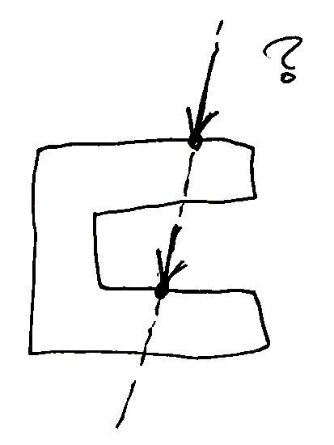
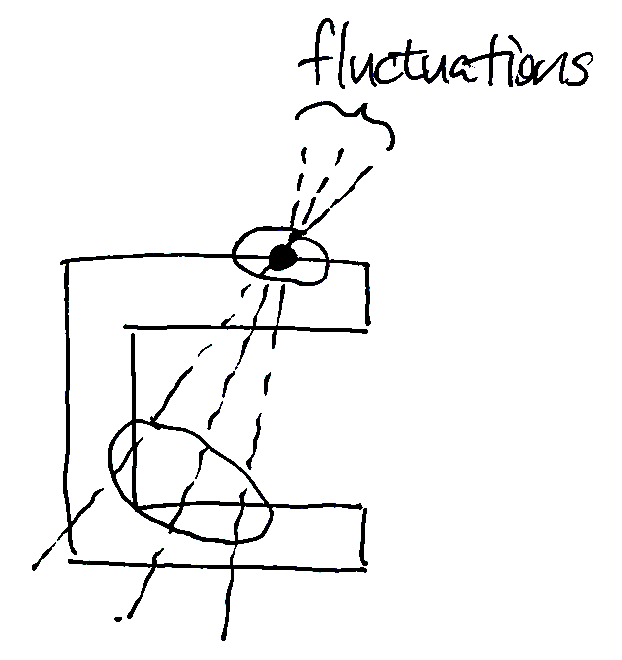
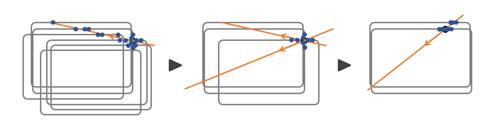

# 導入

人間が道具越しに環境に触れたとき，たとえ目をつむっていても道具のどこにどの程度の力が加わったかを把握することができる。
もちろん道具には神経も感覚器もないので，人間は手先に加わる力情報を使って道具上での接触状態を推定していることになる。では，どうすれば手先の力情報から道具上の接触状態を推定できるのだろうか？

力触覚を基に測定点から離れた箇所の接触状態を推定する技術は intrinsic tactile sensing（*Bicchi and Dario, 1988*）あるいはintrinsic contact sensing（*Bicchi, 1990*; *Tsuji et al., 2017*）と呼ばれる。
最も古い研究事例には *Salisbury, 1984* が挙げられ（もっと古い *Mason, 1981* でも同様の課題が挙げられていたような？），以降も「**力とモーメントから剛体上の接触位置を推定する課題**」を主として様々に研究されている。

# 静力学モデル（単一接触点のみがある場合）

もっとも単純な例を考える。
道具を剛体として，道具に固定された力覚センサ（手先に相当）で力 $\boldsymbol{F}$ とモーメント $\boldsymbol{M}$ を計測しているとする。

道具上の位置 $\boldsymbol{p}$ に接触力 $\boldsymbol{f}$ が加わっていて，力のつり合いが成り立っているとすると，次式が成り立つ：
$$
\begin{aligned}
\boldsymbol{F} &= \boldsymbol{f} &\qquad (1)\\
\boldsymbol{M} &= \boldsymbol{p} \times \boldsymbol{f} &\qquad (2)
\end{aligned}
$$
なお，重力項は事前に同定して測定値から除かれているとした。
また，力のつり合いが成り立っていない場合でも，道具の加速度が測定できれば慣性力を測定値から取り除くことで上式を成立できる。

# 接触位置の推定

上式において既知変数（観測変数）は $\boldsymbol{F}$ と $\boldsymbol{M}$ であり，未知変数は $\boldsymbol{p}$ と $\boldsymbol{f}$ である。
観測変数も未知変数もそれぞれ同じく6次元であるが，実は解を一意に求めることはできない。
これは3次元のベクトル積がfull rankでない歪対称行列として表現されることに由来する。
具体的に説明すると，式(2)に式(1)を代入すれば一次方程式
$$
\boldsymbol{M} = \boldsymbol{p} \times \boldsymbol{F} \qquad (3)
$$
となるが，このとき外積演算を行列とみなしたときの $[\times \boldsymbol{F}]$ は $\boldsymbol{x} \parallel \boldsymbol{F}$ となる任意の $\boldsymbol{x}$ に対して $\boldsymbol{x} [\times \boldsymbol{F}] = \boldsymbol{0}$ となることから正則ではないので，この一次方程式を解くことはできない。

解を一意に求めることができないとはいえ，退化しているのは $\boldsymbol{F}$ の張る1次元の線形部分空間だけなので，他の次元については推定することができる。
$\boldsymbol{p}$ を $\boldsymbol{F}$ と平行なベクトル $\boldsymbol{p}^\parallel$ と垂直なベクトル $\boldsymbol{p}^\perp$ とに分けて
$$
\boldsymbol{p} = \boldsymbol{p}^\parallel + \boldsymbol{p}^\perp
$$
としてやると，
$$
\begin{aligned}
\boldsymbol{M} &= \boldsymbol{p} \times \boldsymbol{F}\\
&= (\boldsymbol{p}^\parallel + \boldsymbol{p}^\perp) \times \boldsymbol{F}\\
&= \boldsymbol{p}^\perp \times \boldsymbol{F}\\
\end{aligned}
$$
とできて，両辺に左から $\boldsymbol{F} \times$ を作用させるとベクトル三重積の性質より
$$
\begin{aligned}
\boldsymbol{F} \times \boldsymbol{M} &= \boldsymbol{F} \times(\boldsymbol{p}^\perp \times \boldsymbol{F})\\
&= (\boldsymbol{F} \cdot \boldsymbol{F}) \boldsymbol{p}^\perp - (\boldsymbol{F} \cdot \boldsymbol{p}^\perp) \boldsymbol{F}\\
&= \|\boldsymbol{F}\|^2 \boldsymbol{p}^\perp
\end{aligned}
$$
となり，結局
$$
\boldsymbol{p}^\perp = \frac{\boldsymbol{F} \times \boldsymbol{M}}{\|\boldsymbol{F}\|^2}
$$
が求まる。
加えて $\boldsymbol{p}^\parallel$ は未知定数 $\alpha$ を用いて
$$
\boldsymbol{p}^\parallel = \alpha \boldsymbol{F}
$$
と表せることから，最終的に $\boldsymbol{p}$ は以下のように表せる：
$$
\boldsymbol{p} = \frac{\boldsymbol{F} \times \boldsymbol{M}}{\|\boldsymbol{F}\|^2} + \alpha \boldsymbol{F} \qquad (4)
$$
この式は直線の方程式と同じ形をしており，1次元分が一意に求まらなくなっている様子がわかる。

ちなみに，ここで力覚センサの数を増やしても状況は全く変わらない。
たとえば力覚センサを2個配置しても，それぞれの測定値を $\boldsymbol{F}_1, \boldsymbol{M}_1$ および $\boldsymbol{F}_2, \boldsymbol{M}_2$ としたときの力のつり合いの式は
$$
\begin{aligned}
\boldsymbol{F}_1 + \boldsymbol{F}_2 &= \boldsymbol{f}\\
\boldsymbol{M}_1 + \boldsymbol{M}_2 &= \boldsymbol{p} \times \boldsymbol{f}
\end{aligned}
$$
となって一次従属な観測変数が増えるだけであり，一次方程式が退化する要因であるクロス積の項は何も変化しない。

# 道具の表面形状が既知の場合

道具の形状が与えられれば接触位置を絞り込むことができる。
ふつう接触は道具表面でのみ起こり，しかも接触力は道具の内向きにはたらく（引っ張る方向にははたらかない）。
この前提を用いれば，接触点の候補を数個程度まで絞り込める。

もっとも簡単なのは道具表面が凸曲面で表されるケースである。
凸曲面と直線との交点は一般的に2点だけなので，接触点は2点に絞られる。
さらに接触力の方向が内向きになるほうを選ぶと，接触点は一意に絞り込まれる。
過去の研究（*Salisbury, 1984*; *Tsuji et al., 2009*）でもよくこの仮定が用いられている。

# 非凸形状のときの推定

非凸な形状の場合は式(4)との交点が3つ以上になることがあり，その場合は接触力の方向を考えても一意に絞られるとは限らない。
たとえばカタカナの「コ」の字型の形状で上面に真下向きの力が加わったとき，式(4)の直線は上面と下面の両方を通るので交点が複数生じる。
このような場合は，過去の測定値や過去の推定値を使うことで統計的に絞り込むことが可能である。

*Kurita et al., 2012* では測定値の時間的なばらつきを利用して候補の絞り込みをおこなっている。
一定期間の中で $\boldsymbol{p}$ は一定であり $\boldsymbol{F}$ のみが時間変化すると仮定して，過去の候補点のうち分散が最小のものを採用するという方法である。
仮定が成り立つとき，式(4)の直線は真の接触位置を回転中心として揺動するように変化する。
揺動の大きさは真の接触位置から離れるほど大きくなることから，揺動が最も小さいものを選べば真の接触点が見つけられる。

# 道具形状が未知のとき

「接触位置 $\boldsymbol{p}$ が一定であり $\boldsymbol{F}$ のみが時間変化する」という仮定を使えば，実は道具の形状を使わなくても接触位置を推定することができる。
式(4)の直線は真の接触位置を回転中心にして変動するので，変動が最小となる点を選べばよい。
*Tsuji et al., 2017* および *Koike et al., 2017* では最小二乗法を使って変動の最も小さい点を選んでいる。

*Tsuji et al., 2017* では以下の最適化問題を解くことで接触位置を推定している：
$$
\min_{\tilde{\boldsymbol{p}}_t} \sum_{\tau=1}^t \left\| \rho^{t-\tau} \left[\boldsymbol{M}_\tau - \tilde{\boldsymbol{p}}_t \times \boldsymbol{F}_\tau \right]\right\|^2
$$
ここで $\rho$ は忘却係数である。
この問題は，式(3)を変形した
$$
\boldsymbol{M} - \boldsymbol{p} \times \boldsymbol{F} = \boldsymbol{0} \qquad (5)
$$
を基に，$\boldsymbol{p}$ が真値からずれるほど $\|\boldsymbol{M} - \boldsymbol{p} \times \boldsymbol{F}\|$ の値が大きくなることを利用している。
（※ 真の接触位置 $\boldsymbol{p}$ から $\Delta\boldsymbol{p}$ だけずれると
$$
\begin{aligned}
\boldsymbol{M} - (\boldsymbol{p} + \Delta\boldsymbol{p}) \times \boldsymbol{F}
&= \boldsymbol{M} - \boldsymbol{p} \times \boldsymbol{F} + - \Delta\boldsymbol{p} \times \boldsymbol{F}\\
&= \Delta\boldsymbol{p} \times \boldsymbol{F}
\end{aligned}
$$
となる。
瞬時値だけだと $\Delta\boldsymbol{p} \parallel \boldsymbol{F}$ のとき $\Delta\boldsymbol{p} \times \boldsymbol{F} = \boldsymbol{0}$ になるが，時刻によって$\boldsymbol{F}$の向きが異なれば二乗の累計がゼロになることはない）

# 道具形状のオンライン推定

（ここから書いている途中……）

形状情報を使わずに測定データの時間変化から推定することの欠点は，推定値の収束が遅くなることである。

式(4)の時間変化で接触位置が推定できて，接触は道具表面でしか起こらないとするなら，逆に式(4)から道具形状を絞り込めると期待できる。
つまり，はじめは *Tsuji et al., 2017* のように形状未知の状態で接触位置を推定していくが，やがて接触位置の推定結果から道具形状を絞り込んでいって，徐々に *Salisbury, 1984* のような形状既知の推定に移行するという方法がとれる。

これを実装したのが *Kutsuzawa et al., 2020* である。
接触位置・接触力・道具形状の3要素がどれも確率的に決まるという状況を直接確率モデルとしてモデリングしている。

# 参考文献

1. A. Bicchi and P. Dario, "Intrinsic Tactile Sensing for  Artificial Hands," in Proc. 4th Int. Symp. on Robotics Research, 1988, pp.83--90.
2. A. Bicchi, "Intrinsic contact sensing for soft fingers," in Proc. IEEE Int. Conf. Robotics and Automation, 1990, p. 968--973.
3. T. Tsuji, T. Seki, and S. Sakaino, "Intrinsic Contact Sensing for Touch Interface With Movable Structure," IEEE Transactions on Industrial Electronics, vol. 64, no. 9, pp. 7342--7349, 2017.
4. J. Salisbury, "Interpretation of contact geometries from force measurements," in Proc. IEEE Int. Conf. Robotics and Automation, 1984, pp. 240--247.
5. M. T. Mason, "Compliance and Force Control for Computer Controlled Manipulators," IEEE Transactions on Systems, Man, and Cybernetics, vol 11, no. 6, pp. 418-432, 1981.
6. T. Tsuji, K. Kaneko, and S. Abe, "Whole-body force sensation by force sensor with shell-shaped end-effector," IEEE Transactions on Industrial Electronics, vol. 56, no. 5, pp. 1375-1382, 2009.
7. N. Kurita, S. Sakaino, and T. Tsuji, "Whole-body force sensation by force sensor with end-effector of arbitrary shape," in Proceedings of IEEE International Conference on Intelligent Robots and Systems, 2012, pp. 5428-5433.
8. R. Koike, S. Sakaino, and T. Tsuji, "Contact Point Estimation in Tactile Interface Using Particle Filter," in Proceedings of the Annual Conference of the IEEE Industrial Electronics Society, 2017, pp. 8267-8272.
9. K. Kutsuzawa, S. Sakaino, and T. Tsuji, "Simultaneous Estimation of Contact Position and Tool Shape using Unscented Particle Filter," IEEJ Journal of Industry Applications, vol. 9, no. 5, pp. 505-514, 2020.
